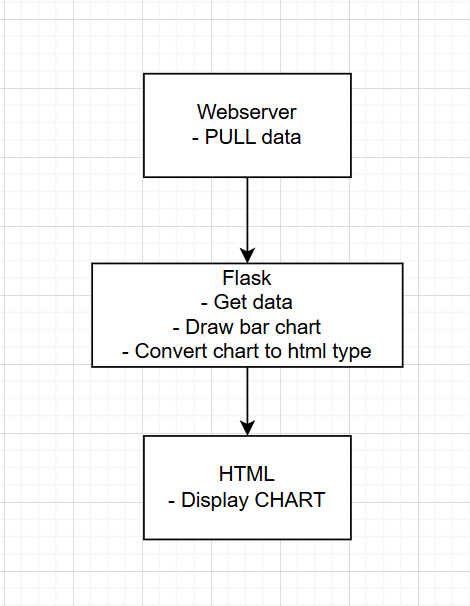
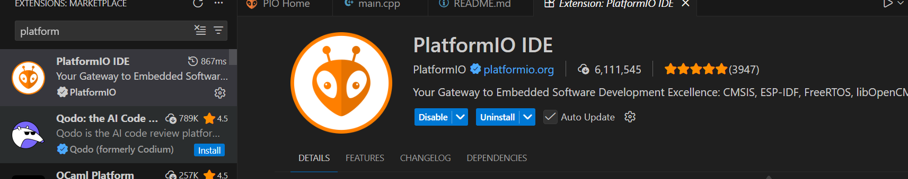
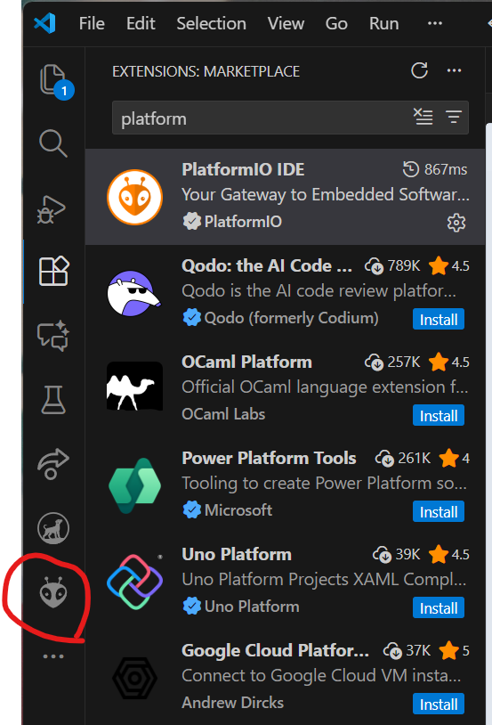
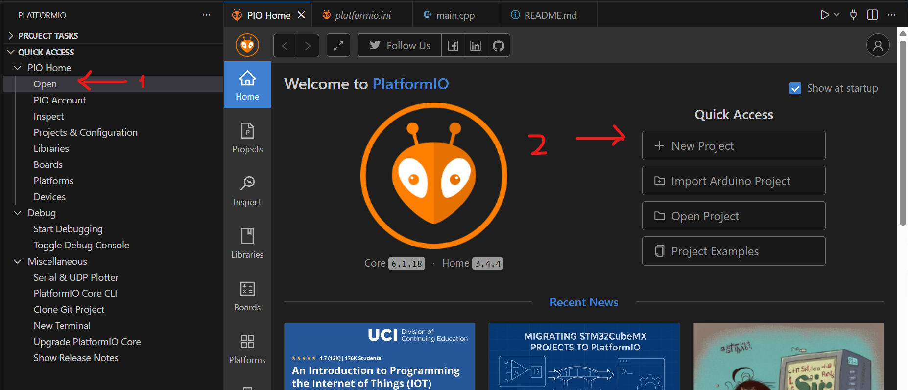
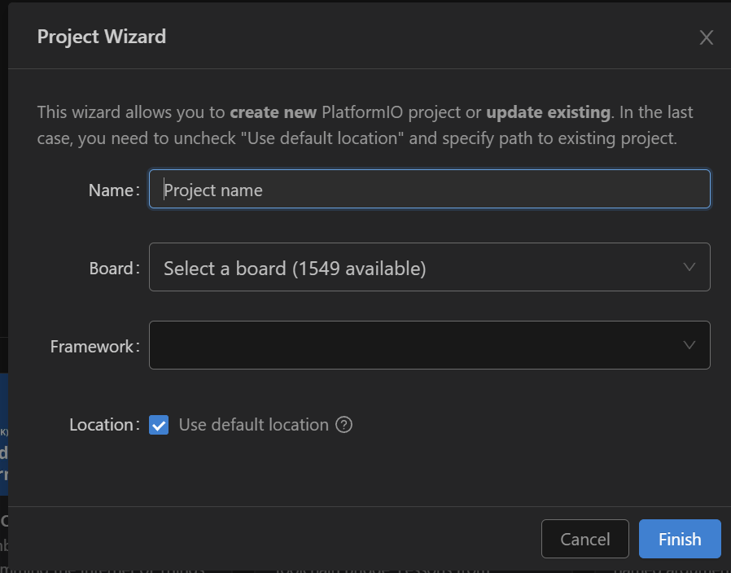
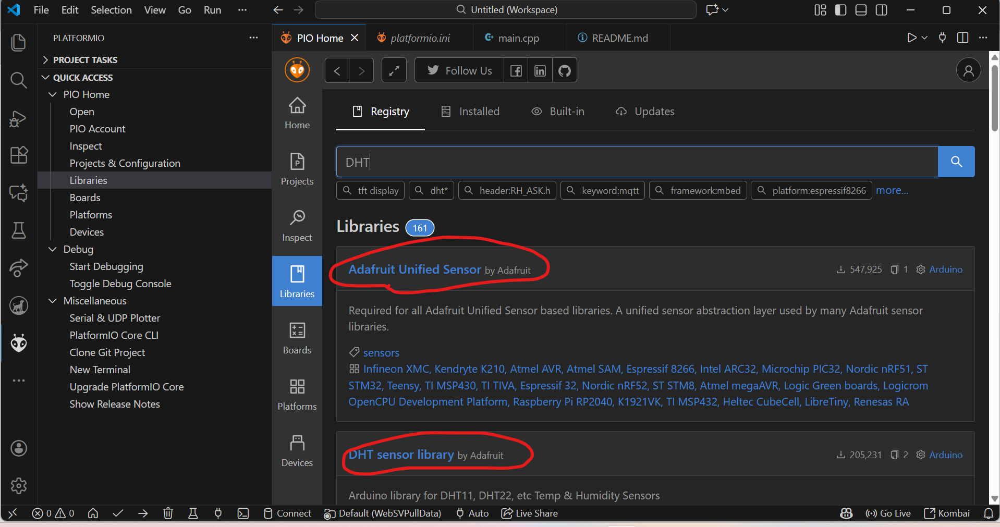
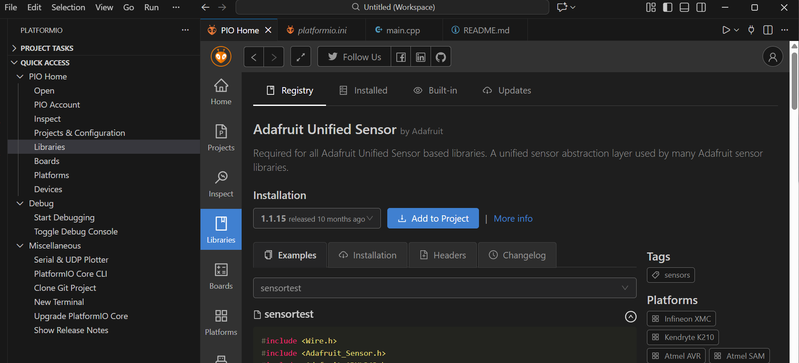
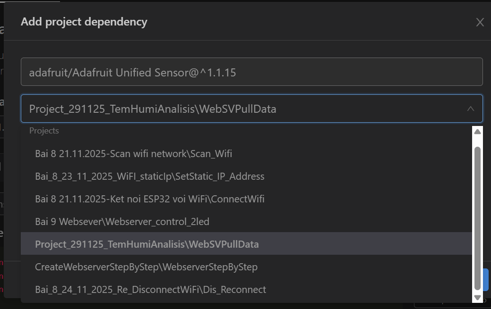
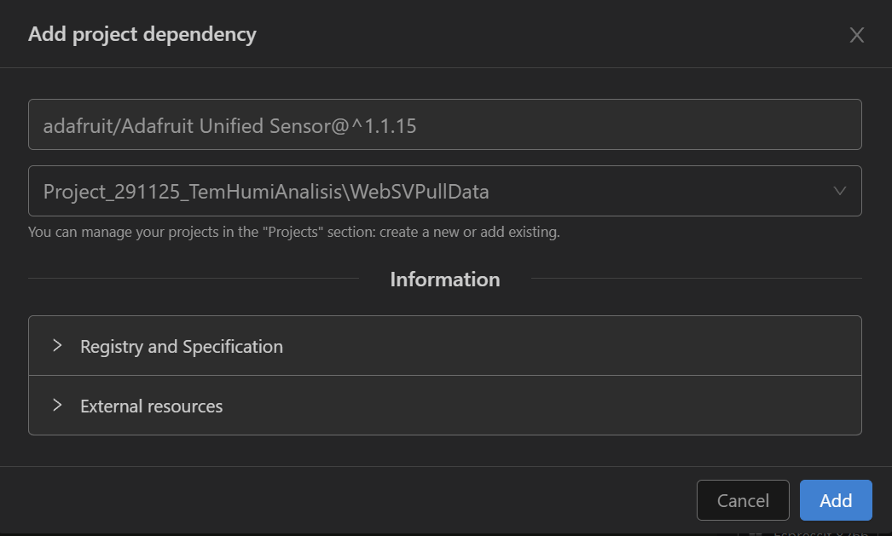

# PROJECT TemHumiAnalisis

- The purpose of this project is mesure **the temperature** and **the humidity** in the room.
- Base on the returned data from **DHT11**, we can analize and compare it with some certain values. Additionally,this project will display a chart with 3 parameter so user can have a multi sight of their **Room's temperature|humidity| hic (heat in celsius)**

## Practical Application

- Nowadays, when you take care of your babe. You need to care the temperature and the humidity in your room because babe is quite vulnerable with inappropriate temperature. So thanks to this **Application**, we can check and adjust our **air-conditional** to suit with your babe.

## Diagram system

## INSTRUCTION

### Folder - Create and execute the WebSVPullData folder

- Step 1 : Install **Platform IO extension** in **Vs code**

- Step 2: The extension will appear in the left corner the **Vs code's screen.**
  - Click this **icon**

- Click **open** then click **New project**

- At **Name:** type **WebSVPullData** or the other name with the same feature
- At **Board:** selcet the appropriate **board**, in this project i use **DOIT DEV KIT V1**
- At **Framework**: choose **Arduino**
- At **Location**: you can use **default loction or deselect and choose another path to save**

- After all, select **Finish**

#### Install DHT library

##### Dowload **Adafruit Unified Sensor**

- Select **Adafruit Unified Sensor**
- Select **Add to project**

- Select the **Project** you just named it.

- After all, select **add**

##### Dowload DHT **Sensor library**

- Do the same work for this library.
  "# TemperatureAnalisis-app"
